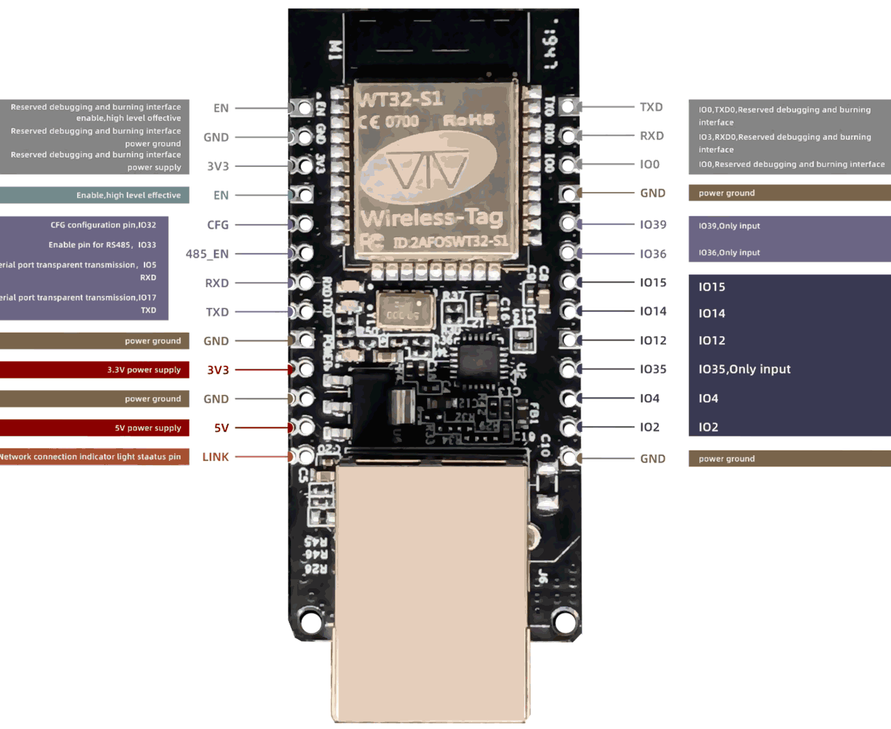
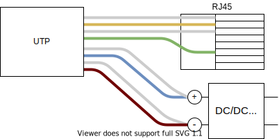
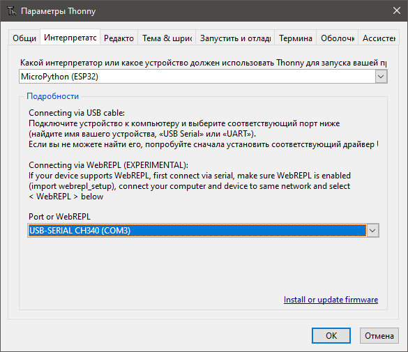
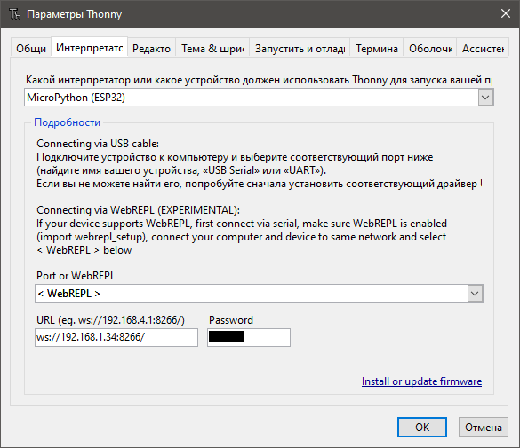

# WT32-ETH01

Модуль на ESP32 с ethernet LAN8720A (datasheet [pdf](WT32-ETH01_datasheet_V1.1-%20en.pdf))

Может работать с [Micropython](../micropython/readme.md)




| Port | type                                                                              |
|------|-----------------------------------------------------------------------------------|
| IO2  | GPIO2, ADC2_CH2, TOUCH2, RTC_GPIO12, HSPIWP, HS2_DATA0, SD_DATA0                  |
| IO4  | GPIO4, ADC2_CH0, TOUCH0, RTC_GPIO10, HSPIHD, HS2_DATA1, SD_DATA1, EMAC_TX_ER      |
| IO35 | GPI35, ADC1_CH7, RTC_GPIO5                                                        |
| IO12 | GPIO12, ADC2_CH5, TOUCH5, RTC_GPIO15, MTDI, HSPIQ, HS2_DATA2, SD_DATA2, EMAC_TXD3 |
| IO14 | GPIO14, ADC2_CH6, TOUCH6, RTC_GPIO16, MTMS, HSPICLK, HS2_CLK, SD_CLK, EMAC_TXD2 |
| IO15 |                                                                                   |
| IO36 |                                                                                   |
| IO39 |                                                                                   |
| IO   |                                                                                   |
| IO   |                                                                                   |


Потребление 80 мА (0,27 Вт), потребление пиковое 500 мА (1,65 Вт).  
PoE не поддерживается, поэтому запитывать придется через дополнительную пару.




## Оживляем

качаем micropython
https://micropython.org/resources/firmware/esp32-idf3-20210202-v1.14.bin

```
pip install esptool
esptool.py --chip esp32 --port COM3 --baud 115200 write_flash -z 0x1000 esp32-idf3-20210202-v1.14.bin
```

Далее ставим

https://thonny.org/



boot.py
```python
# This file is executed on every boot (including wake-boot from deepsleep)
#import esp
#esp.osdebug(None)
import webrepl
import machine
import network

lan = network.LAN(mdc = machine.Pin(23), mdio = machine.Pin(18), power= machine.Pin(16), phy_type = network.PHY_LAN8720, phy_addr=1, clock_mode=network.ETH_CLOCK_GPIO0_IN)
lan.active(True)
lan.ifconfig(('192.168.1.34', '255.255.255.0', '192.168.1.1', '192.168.1.1'))
#               ip                  mask        gateway         dns
webrepl.start()
```

создаем main.py
```python
import machine
import uasyncio as asyncio


pin17 = machine.Pin(17, machine.Pin.OUT)
pin17.value(1)

async def main():
    for i in range(1000):
        await asyncio.sleep_ms(1000)
        print(i)
        if (i % 2) == 0:
            pin17.value(0)
        else:
            pin17.value(1)
        
asyncio.run(main())
```

инициализируем webrepl
```python
import webrepl_setup
```

теперь можно работать через сеть, хотя через COM работает лучше.


