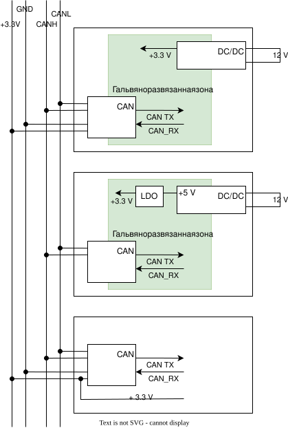

# Модуль расширения

Может подключаться по шине CAN к основному модулю.
Модуль перепрограммируется по WIFI, по умолчанию он выключен.
Включается и выключается WIFI специальной командой по CAN шине.

Изначально модуль прошивается прошивкой, где WIFI включен и ID его на шине CAN равен 0.
Далее меняем его на нужный.

## Электропитание модулей

Первый два способа предпочтительны.

