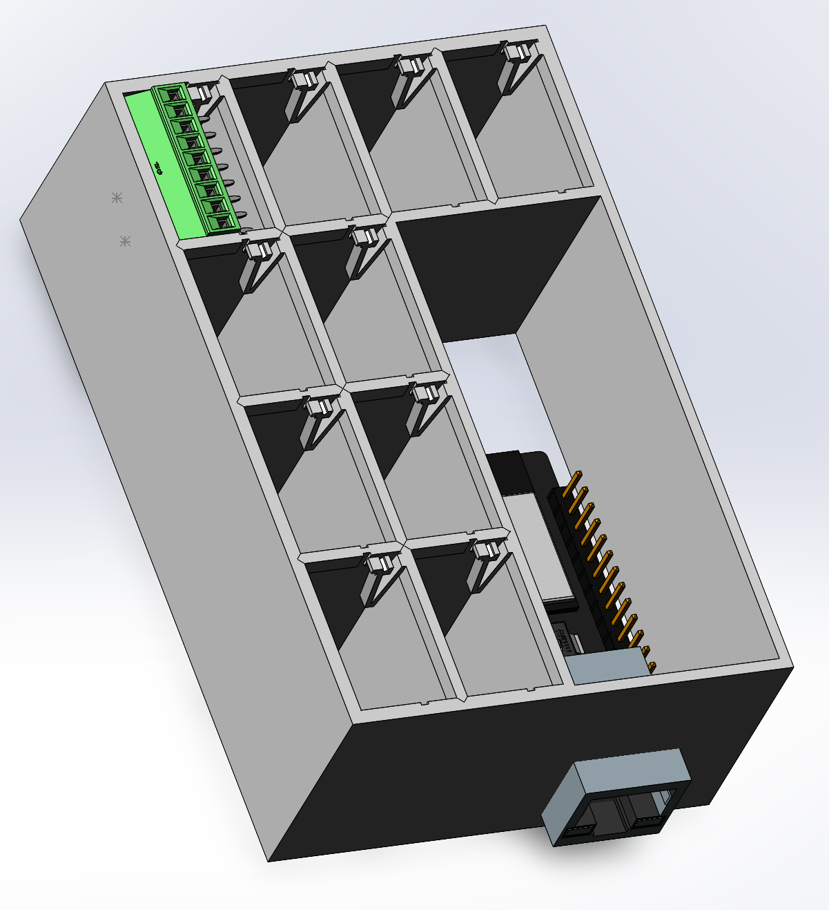
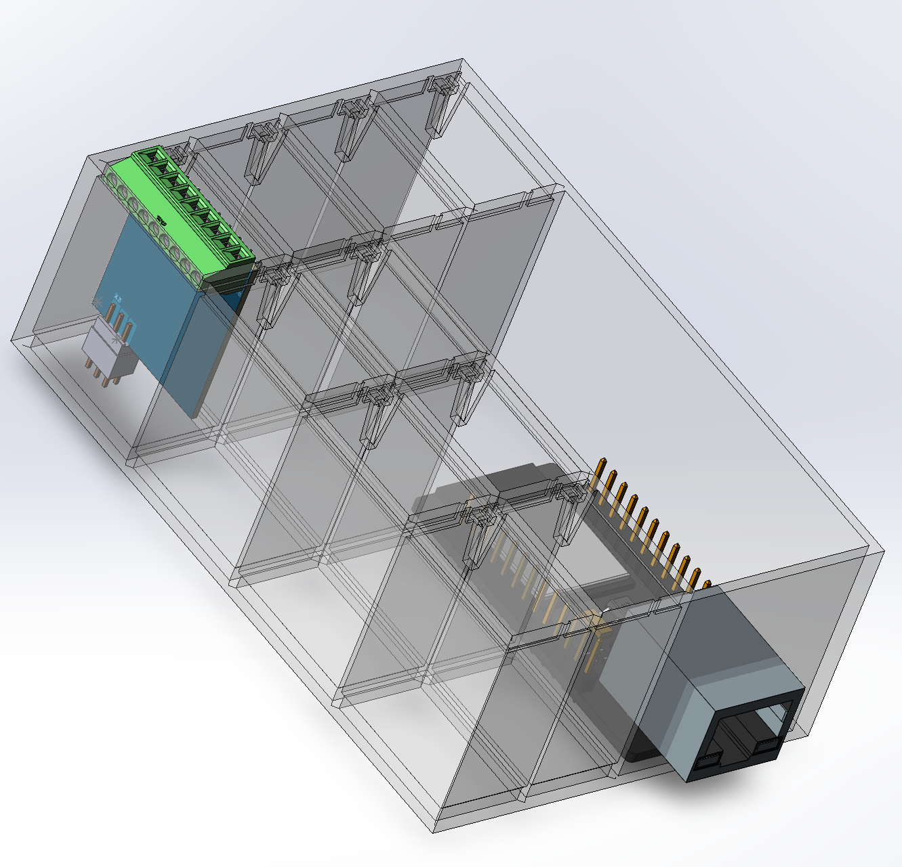
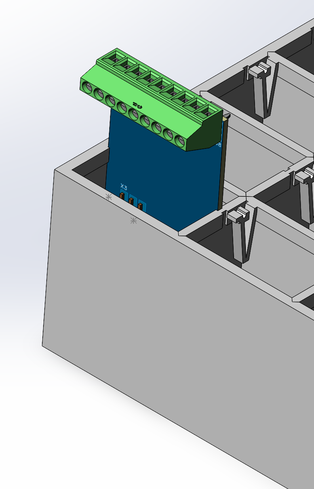
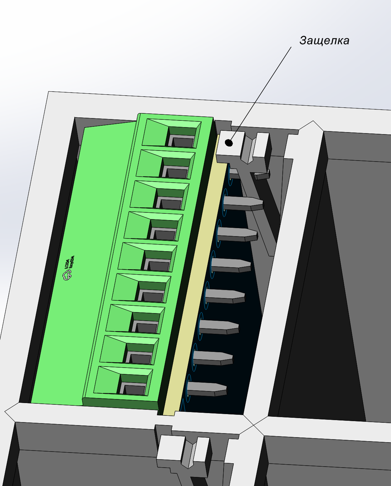
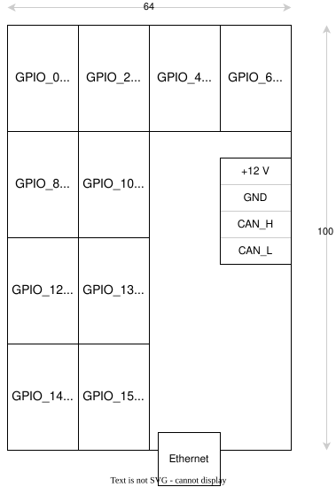
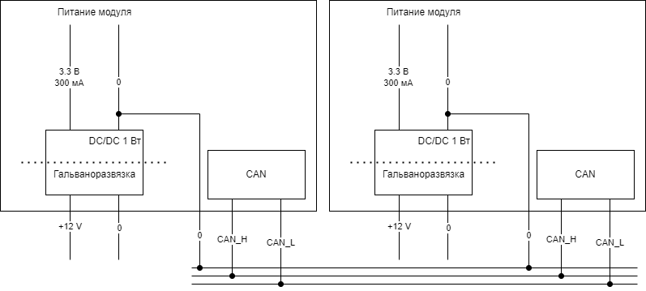

# Модуль шлюза с ethernet

К нему могут подключаться модули расширения по CAN.

Места для модулей есть однопортовые, есть двухпортовые, но везде есть I2C

Фиксируется защелкой

## Концепция электропитания

Каждый модуль развязан гальванически, это очень важно если хотим чтобы работало без глюков.

