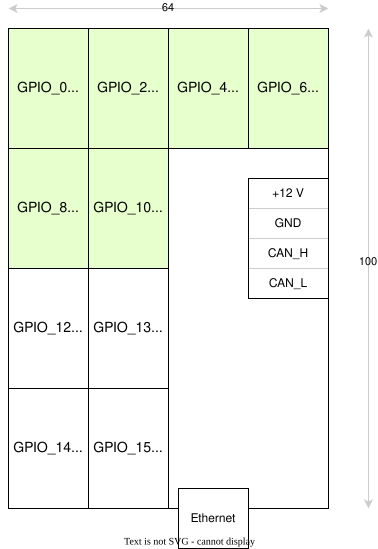

# Модули GPIO на базе ESP32 и Esphome

## Основной модуль

Является также шлюзом с Ethernet сетью.
К нему могут подключаться модули расширения по CAN.

Места для модулей есть однопортовые, есть двухпортовые, но везде есть I2C

## Модуль расширения

Может подключаться по шине CAN к основному модулю.
Модуль перепрограммируется по WIFI, по умолчанию он выключен.
Включается и выключается специальной командой по CAN шине.

Изначально модуль прошивается прошивкой, где WIFI включен и ID его на шине CAN равен 0.
Далее меняем его на нужный.

