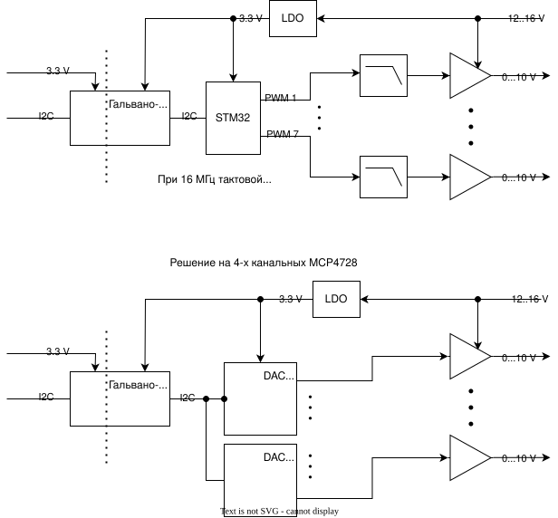
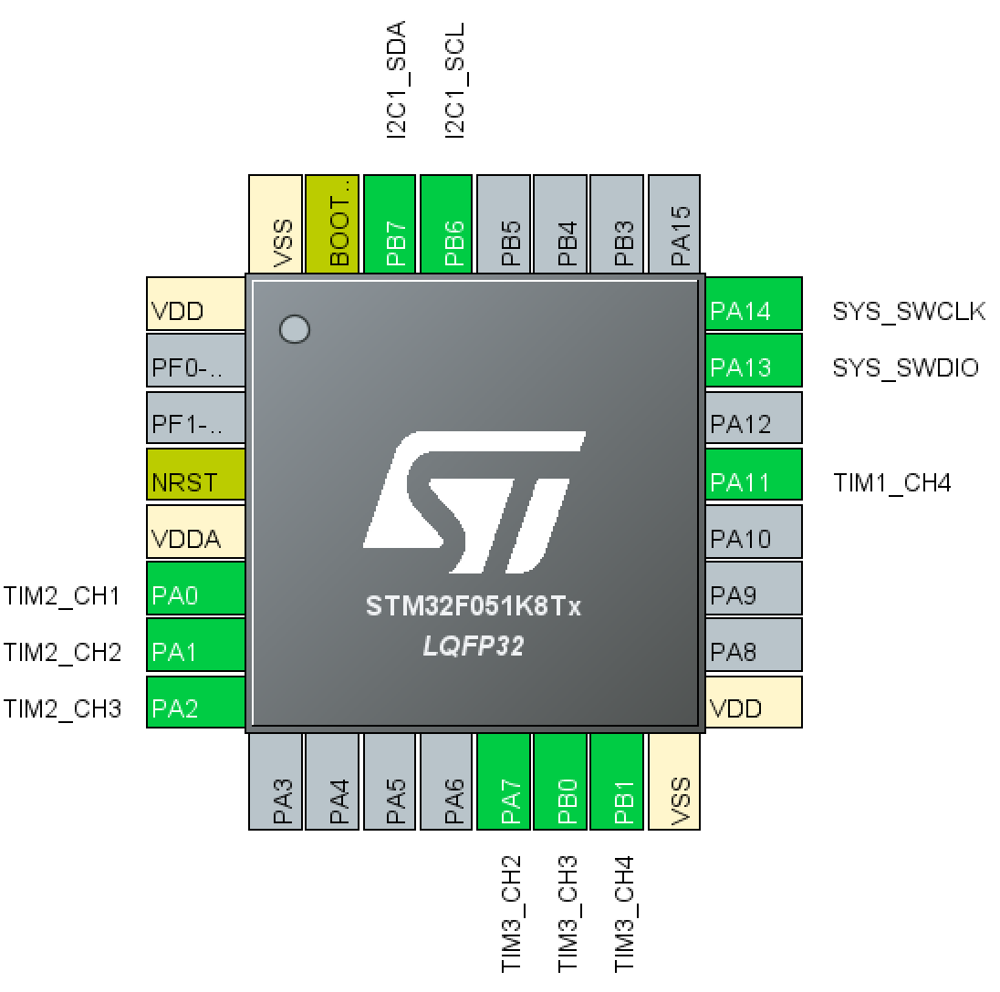

# Оптоизолированный DAC 0-10 В

Схема драйвера на 7 портов

Вторая схема проще, лучше, но требует предварительного программирования 
адресов микросхем.
Для этого пользуем Orange Pi и https://github.com/adafruit/Adafruit_Blinka

Распиновка STM32

