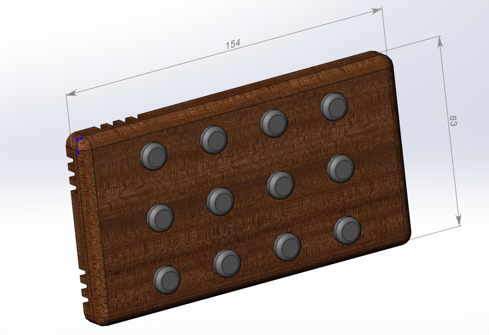

# Настенный модуль

Все действия с умным домом осуществляются со смартфона.
Но зачастую удобнее, например управлять сценариями освещения, с настенной панели с обычными кнопками.
Слева видны верезы для правильной работы датчиков температуры, влажности и СО2.

## Аварийный режим
Возможна ситуация когда наш Home Assistant недоступен.
В пределах одного сегмента сети мы можем посылать и принимать все команды.
Поэтому нажав левые верхние две кнопки секунду, после чего все светодиоды моргнут, мы переходим в аварийное управление светом,
которое надо запрограммировать в модуле предварительно.