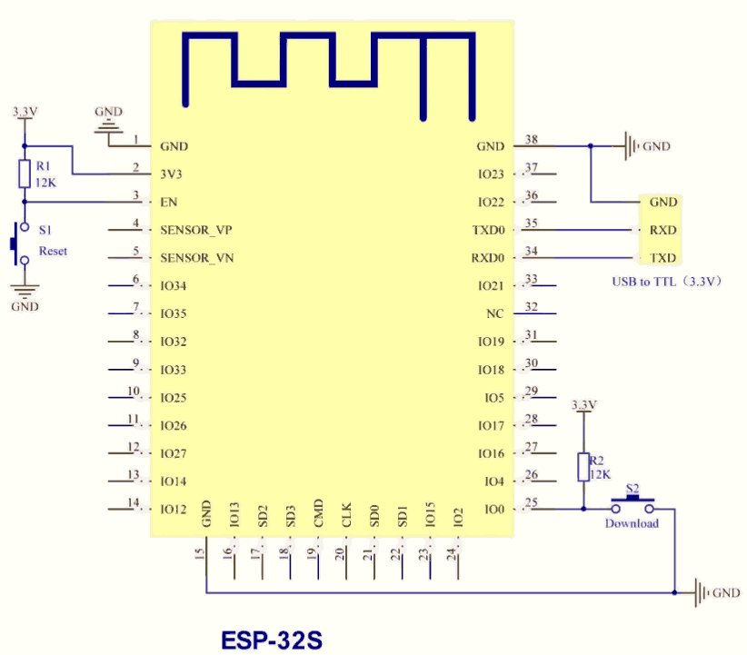
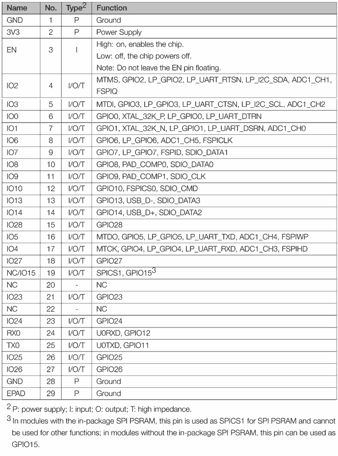
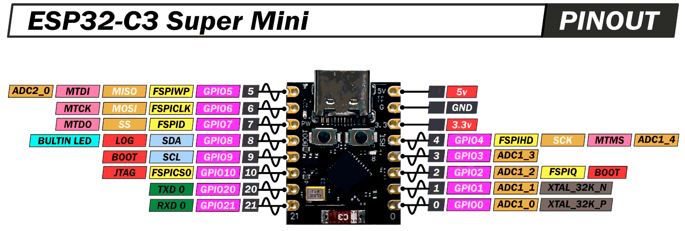
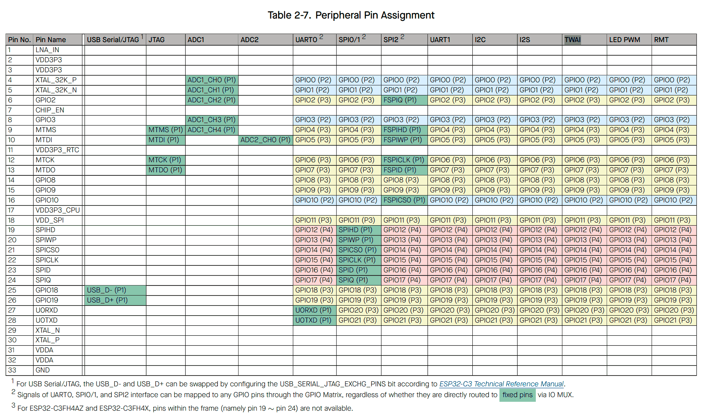
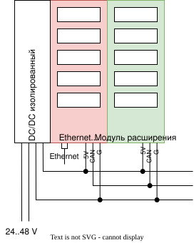

# ESPHome

## Hardware

[Список процессоров и модулей ESP32](https://products.espressif.com/#/product-comparison?type=SoC&names=)

### ESP-32S

<details><summary>ESP-32S</summary>

Самый недорогой модуль, несколько устаревший, но вполне работоспособный.



[ESP32.pdf](ESP32.pdf)

</details>

### ESP-32-C5

Новый чип с поддержкой WiFi6 и ZigBee  
[даташит](https://documentation.espressif.com/esp32-c5-wroom-1_wroom-1u_datasheet_en.html)  
[описание портов](https://documentation.espressif.com/esp32-c5-wroom-1_wroom-1u_datasheet_en.html#[12,%22XYZ%22,56.69,785.2,null])

<details><summary>Порты</summary>



</details>

### ESP-32-C3

Дешевый микромодуль для распайки на субмодули

<details><summary>Выводы</summary>





</details>


### [ESP32-C6 SuperMini](modules/esp32-c6-super-mini/readme.md)

### Готовые платы с поддержкой Ethernet

[KC868-A16](modules/kc868-a16/readme.md)

[WT32-ETH01](modules/WT32-ETH01/readme.md)


### Модули



Удаленных модулей по двухпроводному CAN не будет.
Вместо них модули ethernet.

### Субмодули

[Субмодуль 1](modules/submodule1/readme.md)

## Примеры кода

<details><summary>Поддержка двух CAN шин</summary>

```yaml
canbus:

# inverter
  - platform: esp32_can
    id: inverter
    tx_pin: GPIO03
    rx_pin: GPIO02
    can_id: 100
    bit_rate: 500KBPS
    on_frame:
    - can_id: 0x305
      then:
        - lambda: |-
            ESP_LOGI("main", "received can id: 0x305 ACK");

# BMS
  - platform: esp32_can
    id: bms
    tx_pin: GPIO00
    rx_pin: GPIO01
    can_id: 200
    bit_rate: 500KBPS
    on_frame:
    - can_id: 0x35E
      then:
        - lambda: |-
            ESP_LOGI("canid 0x35e:", "%02x %02x %02x %02x %02x %02x %02x %02x", x[0], x[1], x[2], x[3], x[4], x[5], x[6], x[7]); 
```

</details>

<details><summary>Шаблон кода для модуля с ethernet может быть таким:</summary>

```yaml
substitutions:
  devicename: wt32-0001

esphome:
  name: $devicename
  comment: Living room ESP32 controller
  area: Living Room

esp32:
  board: esp-wrover-kit
  framework:
    type: arduino
    version: latest


ethernet:
  type: LAN8720
  mdc_pin: GPIO23
  mdio_pin: GPIO18
  clk_mode: GPIO0_IN
  phy_addr: 1
  power_pin: GPIO16


# Enable logging
logger:

# Enable Home Assistant API
api:
  encryption:
    key: "TOLsE2i26869JbEJI0r3toI5frqJbreLwvEyZ6bdda4="

ota:
  password: "ase2e12qq"
```

</details>


<details><summary>Работаем с MQTT</summary>

```yaml
mqtt:
  id: mqtt_client
  broker: 192.168.1.194
  username: mqtt
  password: bh0020
  on_connect:
    then:
      - delay: 2s
      - lambda: |-
          ESP_LOGD("mqtt", "Connected to MQTT $devicename");
          id(mqtt_client).publish("$devicename/the/topic", "The Payload");
```

</details>


<details><summary>WiFi по умолчанию отключен</summary>

```yaml
wifi:
  enable_on_boot: false

api:
  reboot_timeout: 0s

on_...:
  then:
    - wifi.disable:

on_...:
  then:
    - wifi.enable:
```

</details>


<details><summary>Субмодули общаются по CAN</summary>

```yaml
substitutions:
  module_id: 1  # номер модуля на CAN шине от 0 до 15

esphome:
  name: module
  name_add_mac_suffix: true

wifi:
  enable_on_boot: false

api:
  reboot_timeout: 0s

on_...:
  then:
    - wifi.disable:

on_...:
  then:
    - wifi.enable:

canbus:
  - platform: ...
    can_id: $module_id
    bit_rate: 25KBPS
    on_frame:
    - can_id: 16
      use_extended_id: false
      then:
      - lambda: |-
```

</details>