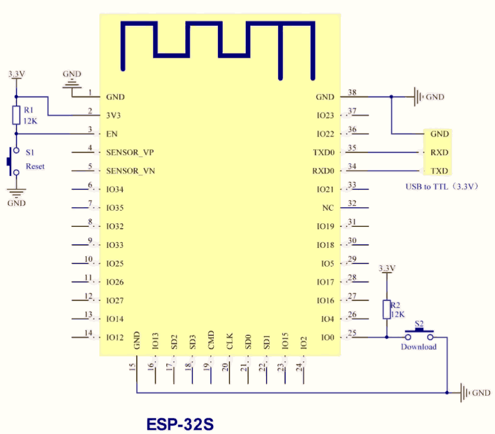

# ESPHome

## Hardware

[Список процессоров и модулей ESP32](https://www.espressif.com/en/products/socs/)

### ESP-32S

<details><summary>ESP-32S</summary>

Самый недорогой модуль, несколько устаревший, но вполне работоспособный.



[ESP32.pdf](ESP32.pdf)

</details>

## Сегмент


Шаблон кода для модуля с ethernet может быть таким:
```yaml
substitutions:
  devicename: wt32-0001

esphome:
  name: $devicename
  comment: Living room ESP32 controller
  area: Living Room

esp32:
  board: esp-wrover-kit
  framework:
    type: arduino
    version: latest


ethernet:
  type: LAN8720
  mdc_pin: GPIO23
  mdio_pin: GPIO18
  clk_mode: GPIO0_IN
  phy_addr: 1
  power_pin: GPIO16


# Enable logging
logger:

# Enable Home Assistant API
api:
  encryption:
    key: "TOLsE2i26869JbEJI0r3toI5frqJbreLwvEyZ6bdda4="

ota:
  password: "ase2e12qq"
```

Работаем с MQTT

```yaml
mqtt:
  id: mqtt_client
  broker: 192.168.1.194
  username: mqtt
  password: bh0020
  on_connect:
    then:
      - delay: 2s
      - lambda: |-
          ESP_LOGD("mqtt", "Connected to MQTT $devicename");
          id(mqtt_client).publish("$devicename/the/topic", "The Payload");
```