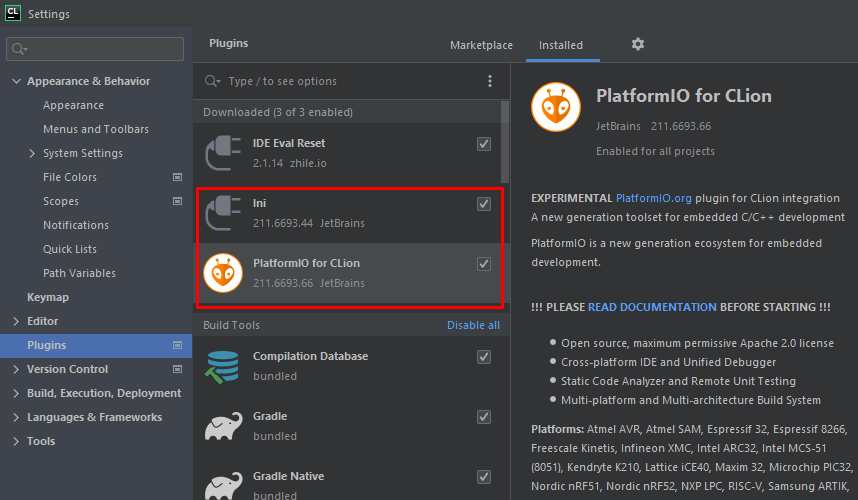
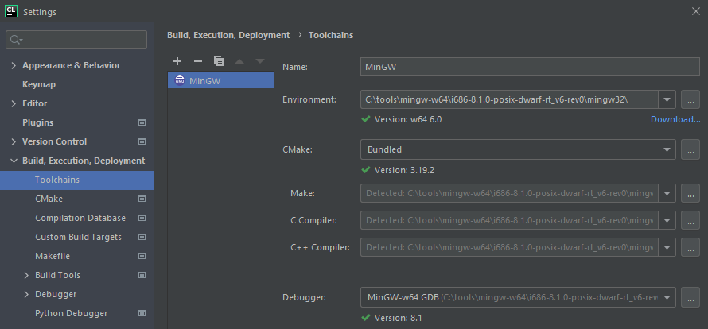
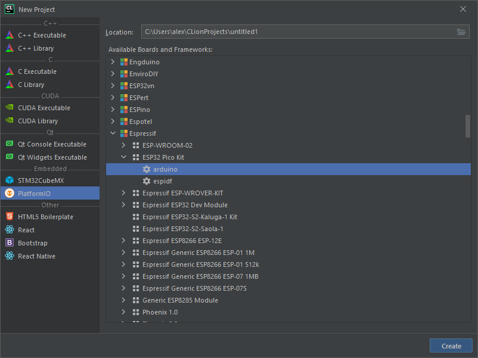
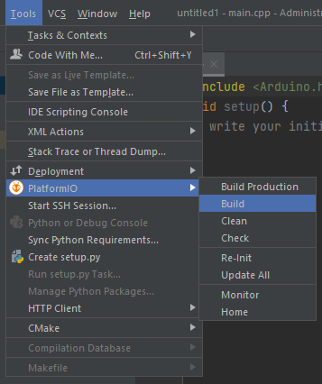

# Сопряжение CLion c Arduino

Устанавливаем [mingw](https://sourceforge.net/projects/mingw-w64/files/Toolchains%20targetting%20Win32/Personal%20Builds/mingw-builds/installer/mingw-w64-install.exe/download).
Ставим например в c:\tools\mingw-w64

Устанавливаем Platformio. Качаем и запускаем скрипт [get-platformio.py](https://raw.githubusercontent.com/platformio/platformio-core-installer/master/get-platformio.py).
Установится в с:\users\UserХХХ\.platformio

Устанавливаем плагины



Указываем где лежит mingw



Создаем новый проект



Работаем



```
Linking .pio\build\pico32\firmware.elf
Retrieving maximum program size .pio\build\pico32\firmware.elf
Checking size .pio\build\pico32\firmware.elf
Advanced Memory Usage is available via "PlatformIO Home > Project Inspect"
RAM:   [          ]   4.0% (used 13224 bytes from 327680 bytes)
Flash: [==        ]  15.4% (used 201304 bytes from 1310720 bytes)
Building .pio\build\pico32\firmware.bin
esptool.py v3.0
========================= [SUCCESS] Took 4.82 seconds =========================
```