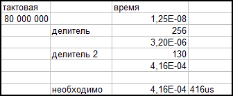
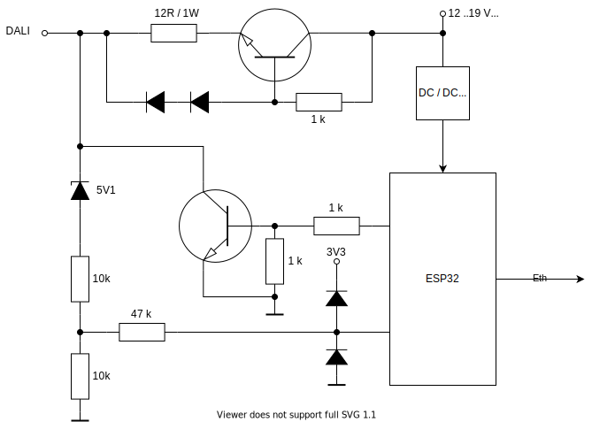

# Интерфейс DALI на базе ESP32ETH

### Принцип кодирования

Сначала преобразуем в манчестерский код, а потом сгенерируем последовательность для RMT.

The RMT is ESP32-specific and allows generation of accurate digital pulses with 12.5ns resolution.

Рассчитываем делитель



Генерим последовательность как в примере с декодированием 10110


```python
import esp32
from machine import Pin

r = esp32.RMT(0, pin=Pin(18), clock_div=256)
# RMT(channel=0, pin=18, source_freq=80000000, clock_div=256)
r.write_pulses((130, 260, 260, 130, 130, 260, 130), start=1) 
# Send 1 for 416us, 0 for 832us, 1 for 832us, 0 for 416us, 1 for 416us, 0 for 832us, 1 for 416us
```

## Принципиальная схема

Так как модуль уже развязан от сети, то оптронов не нужно  
В качестве полевика подойдет SI2304DDS-T1-GE3  
В источнике питания BD139-16, BCP56-16T1G




