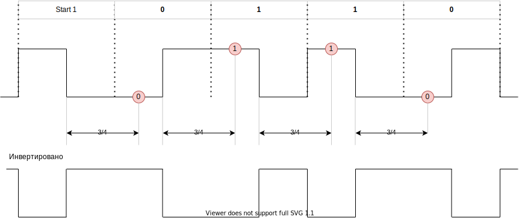
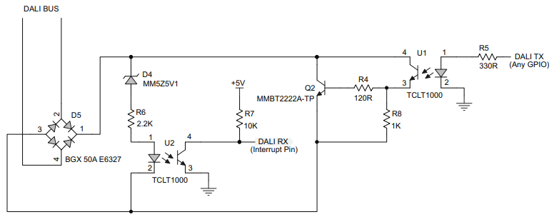

# DALI

в основном взято [отсюда](01465a.pdf)

* интерфейс на базе [ESP32ETH](esp32eth/readme.md)

## Передача сигнала


### Frame timing


### Принцип декодирования




```python
import esp32
from machine import Pin

r = esp32.RMT(0, pin=Pin(18), clock_div=256)
# RMT(channel=0, pin=18, source_freq=80000000, clock_div=256)
r.write_pulses((130, 260, 260, 130, 130, 260, 130), start=1) 
# Send 1 for 416us, 0 for 832us, 1 for 832us, 0 for 416us, 1 for 416us, 0 for 832us, 1 for 416us
```

## Команды DALI

[см.](command.md)

## Команды DALI MQTT

`dali/ha/SET_LEVEL/32` Установить яркость светильника 32

payload

| byte |  |
| ---- | ----|
| 0 | level 0..255 |

`dali/ha/SET_LEVEL_GRP/12` Установить яркость группы 12

payload

| byte |  |
| ---- | ----|
| 0 | level 0..255 |

## Схемы

### Схема с опторазвязкой



Q2 - 600mA, 40V, hfe 100..300  
U1, U2 - TLP183