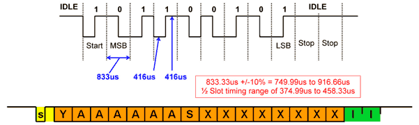

# DALI

в основном взято [отсюда](01465a.pdf)

## Передача сигнала

### Frame timing

### Принцип декодирования

## Команды DALI

| Command            | Description                           | Addressable | Reply from slave | Value range |
| ------------------ | ------------------------------------- | ----------- | ---------------- | ----------- |
| arc                | direct arc power control              | *           | *                | 0..254      |
| off                | turn off without fading               | *           | *                |             |
| up                 | dim up using the selected fade rate   | *           | *                |             |
| down               | dim down using the selected fade rate | *           | *                |             |
| stepup             | step up                               | *           |                  |             |
| stepdown           | step down                             | *           |                  |             |
| recallmax          | recall max level                      | *           |                  |             |
| recallmin          | recall min level                      | *           |                  |             |
| stepdownoff        | step down and off                     | *           |                  |             |
| stepupon           | on and step up                        |             |                  |             |
| gotoscene          | go to scene                           |             |                  | 0..15       |
| reset              | reset                                 |             |                  |             |
| storeactual        | store actual level in the dtr         |             |                  |             |
| storemax           | store the dtr as max level            |             |                  |             |
| storemin           | store the dtr as min level            |             |                  |             |
| storesystemfailure | store the dtr as system failure level |             |                  |             |
| storepoweron       | store the dtr as power on level       |             |                  |             |
| storefadetime      | store the dtr as fade time            |             |                  |             |
| storefaderate      | store the dtr as fade rate            |             |                  |             |
| storescene         | store the dtr as scene                |             |                  | 0..15       |
| removescene        | remove from scene                     |             |                  | 0..15       |
| addtogroup         | add to group                          |             |                  | 0..15       |
| removefromgroup    | remove from group                     |             |                  | 0..15       |
| storeshortaddress  | store dtr as short address            |             |                  |             |
| querystatus        | query status                          |             |                  |             |
| queryballast       | query ballast                         |             |                  |             |
| querylampfailure   | query lamp failure                    |             |                  |             |
| querylamppoweron   | query lamp power on                   |             |                  |             |
| querylimiterror    | query limit error                     |             |                  |             |
| queryresetstate    | query reset state                     |             |                  |             |
| querymissingshort  | query missing short address           |             |                  |             |
| queryversion       | query version number                  |             |                  |             |
| querydtr           | query content dtr                     |             |                  |             |
| querydevicetype    | query device type                     |             |                  |             |
| queryphysicalmin   | query physical minimum level          |             |                  |             |
| querypowerfailure  | query power failure                   |             |                  |             |
| queryactual        | query actual level                    |             |                  |             |
| querymax           | query max level                       |             |                  |             |
| querymin           | query min level                       |             |                  |             |
| querypoweron       | query power on level                  |             |                  |             |
| querysystemfailure | query system failure level            |             |                  |             |
| queryfadetimerate  | query fade time / fade rate           |             |                  |             |
| queryscene         | query scene level (scenes 0-15)       |             |                  | 0..15       |
| querygroupslow     | query groups 0-7                      |             |                  |             |
| querygroupshigh    | query groups 8-15                     |             |                  |             |
| queryrandomaddrh   | query random address (high)           |             |                  |             |
| queryrandomaddrm   | query random address (middle)         |             |                  |             |
| queryrandomaddrl   | query random address (low)            |             |                  |             |
| terminate          | terminate                             |             |                  |             |
| setdtr             | set data transfer register (dtr)      |             |                  | 0..255      |
| initialise         | initialise                            |             |                  |             |
| randomise          | randomise                             |             |                  |             |
| compare            | compare                               |             |                  |             |
| withdraw           | withdraw                              |             |                  |             |
| searchaddrh        | set search address (high)             |             |                  | 0..255      |
| searchaddrm        | set search address (middle)           |             |                  | 0..255      |
| searchaddrl        | set search address (low)              |             |                  | 0..255      |
| programshortaddr   | program short address                 |             |                  | 0..63       |
| verifyshortaddr    | verify short address                  |             |                  | 0..63       |
| queryshortaddr     | query short address                   |             |                  |             |
| physicalselection  | physical selection                    |             |                  |             |
| enabledevicetype   | enable device type x                  |             |                  | 0..255      |

## Схема с опторазвязкой

Q2 - 600mA, 40V, hfe 100..300  
U1, U2 - TLP183