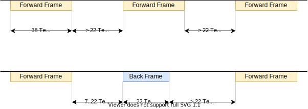

# DALI

в основном взято [отсюда](01465a.pdf)

* интерфейс на базе [ESP32ETH](esp32eth/readme.md)

## Передача сигнала

### Frame timing

### Принцип декодирования

## Команды DALI

[см.](command.md)

## Команды DALI MQTT

| topic | Команда | payload | return |
| ----  | ----    | ----    | ----   |
| `dali/ha/set_level/32`     | **Установить яркость светильника** 32   | b'\0' .. b'\254' |    |
| `dali/ha/set_level_grp/12` | **Установить яркость группы** 12        | b'\0' .. b'\254' |    |

## Схемы

### Схема с опторазвязкой

Q2 - 600mA, 40V, hfe 100..300  
U1, U2 - TLP183