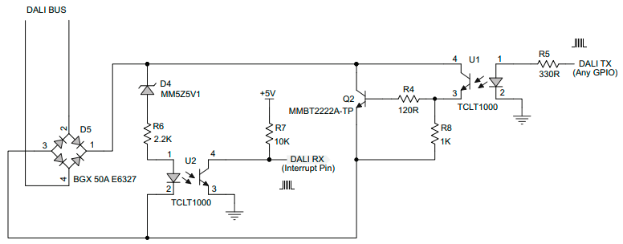

# DALI

в основном взято [отсюда](01465a.pdf)

## Передача сигнала

### Frame timing

### Принцип декодирования

## Команды DALI
| #        | Command Code          | Repeat < 100 ms | Answer Slave | Command Name                          |  | 
| -------- | --------------------- | ------------------ | --------------- | ------------------------------------- | ---- |
| \-       | `YAAA AAA0 XXXX XXXX` | no                 |                 | DIRECT ARC POWER CONTROL              | Установить яркость светильника с адресом 0AAA AAA или группы светильников с адресом 100A AAA или группы светильников с адресом 100A AAA равной значению XXXX XXXX в течение FADE TIME |
| 0        | `YAAA AAA1 0000 0000` | no                 |                 | OFF                                   | Выключить светильник с адресом AAA AAA или группу светильников с адресом 100A AAA                                                                                                           |
| 1        | `YAAA AAA1 0000 0001` | no                 |                 | UP                                    | Увеличивать яркость светильника с адресом 0AAA AAA или группы светильников с адресом 100A AAA в течение 200 мс со скоростью FADE RATE                                                    |
| 2        | `YAAA AAA1 0000 0010` | no                 |                 | DOWN                                  | Уменьшать яркость светильника с адресом 0AAA AAA или группы светильников с адресом 100A AAA в течение 200 мс со скоростью FADE RATE                                                      |
| 3        | `YAAA AAA1 0000 0011` | no                 |                 | STEP UP                               | Увеличить яркость светильника с адресом 0AAA AAA или группы светильников с адресом 100A AAA на один шаг                                                                                  |
| 4        | `YAAA AAA1 0000 0100` | no                 |                 | STEP DOWN                             | Уменьшить яркость светильника с адресом 0AAA AAA или группы светильников с адресом 100A AAA на один шаг                                                                                  |
| 5        | `YAAA AAA1 0000 0101` | no                 |                 | RECALL MAX LEVEL                      | Установить яркость светильника с адресом 0AAA AAA или группы светильников с адресом 100A AAA на уровень MAX\_LEVEL                                                                       |
| 6        | `YAAA AAA1 0000 0110` | no                 |                 | RECALL MIN LEVEL                      | Установить яркость светильника с адресом 0AAA AAA или группы светильников с адресом 100A AAA на уровень MIN\_LEVEL                                                                       |
| 7        | `YAAA AAA1 0000 0111` | no                 |                 | STEP DOWN AND OFF                     | Уменьшить яркость светильника с адресом 0AAA AAA или группы светильников с адресом 100A AAA на один шаг, если яркость на уровне MIN\_LEVEL – выключить светильник                     |
| 8        | `YAAA AAA1 0000 1000` | no                 |                 | ON AND STEP UP                        | Увеличить яркость светильника с адресом 0AAA AAA или группы светильников с адресом 100A AAA на один шаг, если светильник выключен – установить яркость на уровне MIN\_LEVEL           |
| 9-15     | `YAAA AAA1 0000 1XXX` |                    |                 | RESERVED                              |                                                                                                                                                                                             |
| 16-31    | `YAAA AAA1 0001 XXXX` | no                 |                 | GO TO SCENE                           | Светильнику с адресом 1AAA AAA или группе светильников с адресом 100А ААА перейти к сцене XXXX                                                                                           |
| 32       | `YAAA AAA1 0010 0000` | yes                |                 | RESET                                 |                                                                                                                                                                                             |
| 33       | `YAAA AAA1 0010 0001` | yes                |                 | STORE ACTUAL LEVEL IN THE DTR         |                                                                                                                                                                                             |
| 34 - 41  | `YAAA AAA1 0010 XXXX` |                    |                 | RESERVED                              |                                                                                                                                                                                             |
| 42       | `YAAA AAA1 0010 1010` | yes                |                 | STORE THE DTR AS MAX LEVEL            | Светильнику с адресом 1AAA AAA или группе светильников с адресом 100А ААА сохранить значение регистра DTR в качестве MAX\_LEVEL                                                          |
| 43       | `YAAA AAA1 0010 1011` | yes                |                 | STORE THE DTR AS MIN LEVEL            | Светильнику с адресом 1AAA AAA или группе светильников с адресом 100А ААА сохранить значение регистра DTR в качестве MIN\_LEVEL                                                          |
| 44       | `YAAA AAA1 0010 1100` | yes                |                 | STORE THE DTR AS SYSTEM FAILURE LEVEL | Светильнику с адресом 1AAA AAA или группе светильников с адресом 100А ААА сохранить значение регистра DTR в качестве SYSTEM\_FAILURE\_LEVEL                                              |
| 45       | `YAAA AAA1 0010 1101` | yes                |                 | STORE THE DTR AS POWER ON LEVEL       | Светильнику с адресом 1AAA AAA или группе светильников с адресом 100А ААА сохранить значение регистра DTR в качестве POWER\_ON\_LEVEL                                                    |
| 46       | `YAAA AAA1 0010 1110` | yes                |                 | STORE THE DTR AS FADE TIME            | Светильнику с адресом 1AAA AAA или группе светильников с адресом 100А ААА сохранить значение регистра DTR в качестве FADE\_TIME                                                          |
| 47       | `YAAA AAA1 0010 1111` | yes                |                 | STORE THE DTR AS FADE RATE            | Светильнику с адресом 1AAA AAA или группе светильников с адресом 100А ААА сохранить значение регистра DTR в качестве FADE\_RATE                                                          |
| 48 - 63  | `YAAA AAA1 0011 XXXX` |                    |                 | RESERVED                              |                                                                                                                                                                                             |
| 64 - 79  | `YAAA AAA1 0100 XXXX` | yes                |                 | STORE THE DTR AS SCENE                | Светильнику с адресом 1AAA AAA или группе светильников с адресом 100А ААА сохранить значение регистра DTR в качестве уровня яркости для сцены XXXX                                    |
| 80 - 95  | `YAAA AAA1 0101 XXXX` | yes                |                 | REMOVE FROM SCENE                     | Светильнику с адресом 1AAA AAA исключить себя из сцены XXXX                                                                                                                                 |
| 96 - 111 | `YAAA AAA1 0110 XXXX` | yes                |                 | ADD TO GROUP                          | Светильнику с адресом 1AAA AAA войти в группу XXXX                                                                                                                                          |
| 112 -127 | `YAAA AAA1 0111 XXXX` | yes                |                 | REMOVE FROM GROUP                     | Светильнику с адресом 1AAA AAA исключить себя из группы XXXX                                                                                                                                |
| 128      | `YAAA AAA1 1000 0000` | yes                |                 | STORE DTR AS SHORT ADDRESS            | Светильнику с адресом 1AAA AAA установить себе значение из регистра DTR в качестве нового короткого адреса                                                                               |
| 129 -143 | `YAAA AAA1 1000 XXXX` |                    |                 | RESERVED                              |                                                                                                                                                                                             |
| 144      | `YAAA AAA1 1001 0000` | no                 | yes             | QUERY STATUS                          |                                                                                                                                                                                             |
| 145      | `YAAA AAA1 1001 0001` | no                 | yes             | QUERY BALLAST                         |                                                                                                                                                                                             |
| 146      | `YAAA AAA1 1001 0010` | no                 | yes             | QUERY LAMP FAILURE                    |                                                                                                                                                                                             |
| 147      | `YAAA AAA1 1001 0011` | no                 | yes             | QUERY LAMP POWER ON                   |                                                                                                                                                                                             |
| 148      | `YAAA AAA1 1001 0100` | no                 | yes             | QUERY LIMIT ERROR                     |                                                                                                                                                                                             |
| 149      | `YAAA AAA1 1001 0101` | no                 | yes             | QUERY RESET STATE                     |                                                                                                                                                                                             |
| 150      | `YAAA AAA1 1001 0110` | no                 | yes             | QUERY MISSING SHORT ADDRESS           |                                                                                                                                                                                             |
| 151      | `YAAA AAA1 1001 0111` | no                 | yes             | QUERY VERSION NUMBER                  |                                                                                                                                                                                             |
| 152      | `YAAA AAA1 1001 1000` | no                 | yes             | QUERY CONTENT DTR                     |

## Схема с опторазвязкой

Q2 - 600mA, 40V, hfe 100..300  
U1, U2 - TLP183