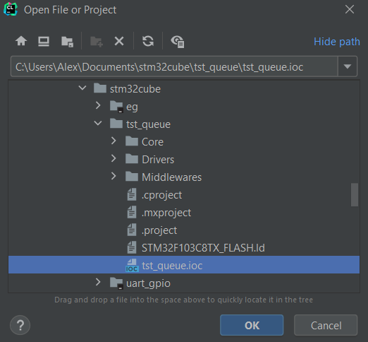
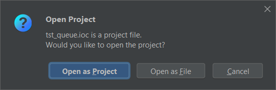
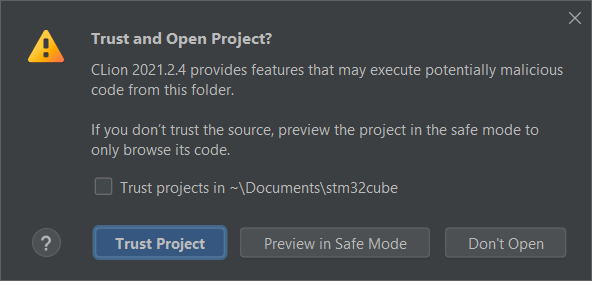
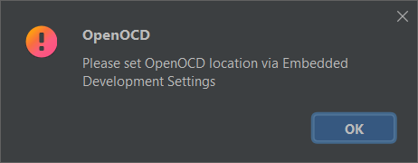
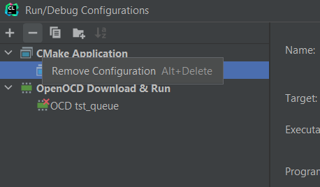
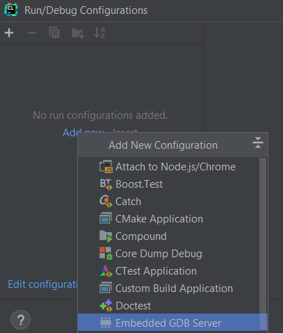
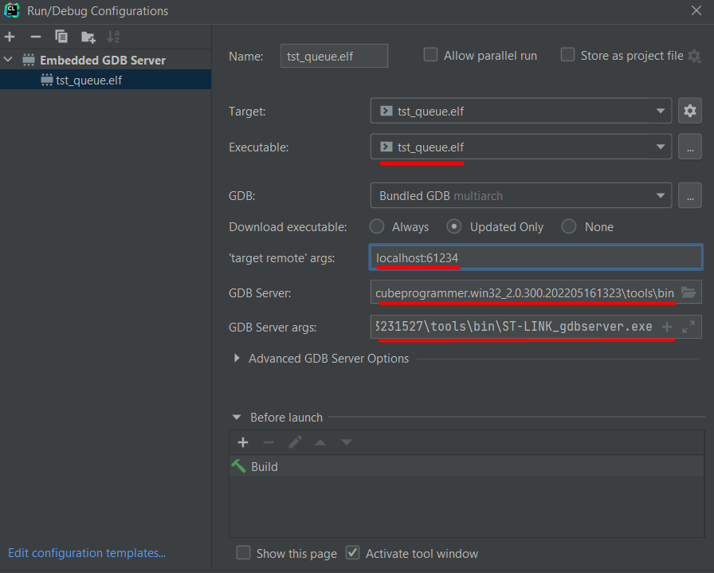

# Настройка CLion

## Импортируем проект STM32CubeMX







Закрываем не обращая внимания.



## Настраиваем дебаггер

Menu -> Run -> Edit Configuration




Удаляем все конфигурации и создаем







GDB Server:
```
D:\Alex\dev\STM32CubeIDE\plugins\com.st.stm32cube.ide.mcu.externaltools.stlink-gdb-server.win32_2.0.300.202203231527\tools\bin\ST-LINK_gdbserver.exe
```
GDB Server args:
```
-p 61234 -l 1 -d -s -m 0 -k -cp D:\Alex\dev\STM32CubeIDE\plugins\com.st.stm32cube.ide.mcu.externaltools.cubeprogrammer.win32_2.0.300.202205161323\tools\bin
```