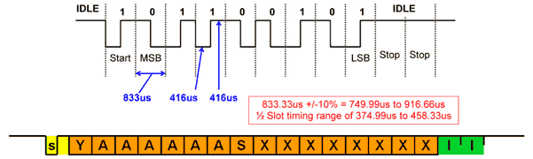
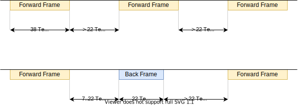
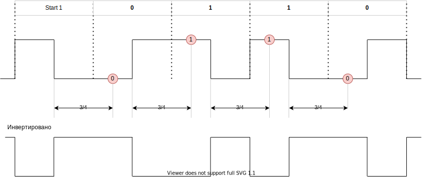
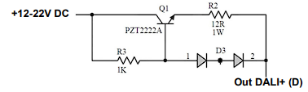

# DALI

в основном взято [отсюда](01465a.pdf)

* интерфейс на базе [ESP32ETH](esp32eth/readme.md)

## Передача сигнала



### Frame timing



### Принцип декодирования



<details>
  <summary>Реализация Micropython</summary>

Для варианта с инверсией

```python
from machine import Pin
import time
import asyncio

class ReceiveFromDali:
    p0 = Pin(0, Pin.IN)
    not_react_f = False
    return_byte = 0
    return_byte_cnt = 1
    
   
    @classmethod
    def callback_start(cls, p):
        cls.p0.irq(trigger=Pin.IRQ_RISING | Pin.IRQ_FALLING, handler=cls.callback_read)
    
    @classmethod
    def callback_read(cls, p):
        if not cls.not_react_f:
            cls.not_react_f = True
            time.sleep_us(625)  # треть периода
            # читаем и добавляем
            val = cls.p0.value()
            if val == 0 and cls.return_byte_cnt <= 128:
                cls.return_byte = cls.return_byte | cls.return_byte_cnt
            cls.return_byte_cnt = cls.return_byte_cnt << 1
            cls.not_react_f = False
            
    
    @classmethod
    async def receive(cls):
        cls.not_react_f = False
        cls.return_byte = 0
        cls.return_byte_cnt = 1
        cls.p0.irq(trigger=Pin.IRQ_RISING, handler=cls.callback_start)
        await asyncio.sleep_ms(12)  # что бы не произошло выходим через 12 мс
        cls.p0.irq()
        return cls.return_byte
```

</details>

## Команды DALI

[см.](command.md)

## Схемы

### Схема с опторазвязкой


Q2 - 600mA, 40V, hfe 100..300  
U1, U2 - TLP183

### Питание

