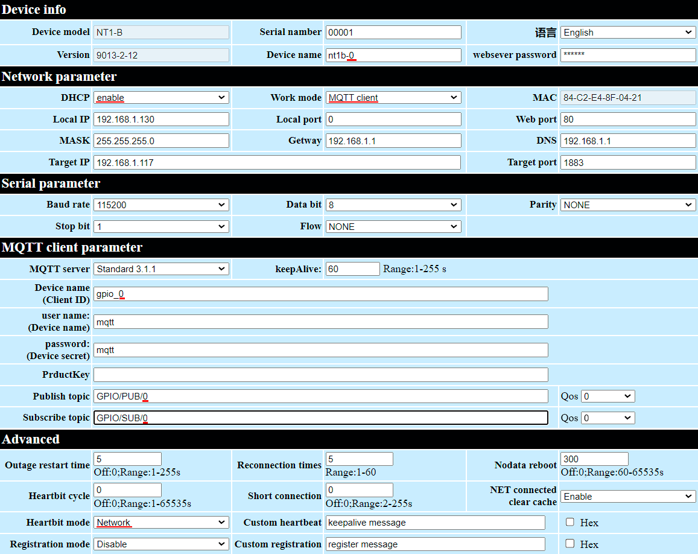
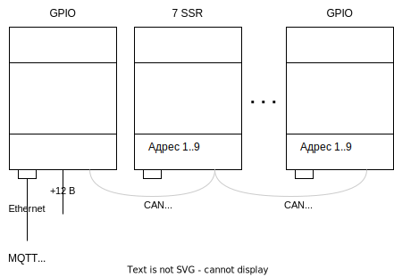

# GPIO - Ethernet

https://www.cdebyte.com/products/NT1-B

## Настройка модуля

Настройка модуля

  
Первоначально модуль сидит на статическом адресе 192.168.3.3
настраиваем сеть компа и заходим

Настоятельно рекомендую настроить именно автоматическое получение адреса по DHCP.

Устанавливаем там где 0, нужный нам порядковый номер модуля и нажимаем submit,
пароль для сохранения 123456 после чего перезагружаем по питанию.

В сети его потом можно будет найти по доменному имени MAC адресу:

## Команды

Все команды пятибайтовые: номер_модуля/номер_подмодуля/команда/порт/значение

Для преобразования в удобочитаемые команды применяется сервис [mqtt_gpio](mqtt_gpio_service/readme.md)

### MQTT -> GPIO

| команда                        | описание                                 | Mqtt                       |
|--------------------------------|------------------------------------------|----------------------------|
| 01 00 **00** (00..31) 00       | выключить порт (00..31)                  | `GPIO/1/0/SET/25/0`        |
| 01 00 **00** (00..31) (1..255) | включить порт (00..31)                   | `GPIO/1/0/SET/25/1`        |
| 01 00 **00** (00..31) (0..255) | установить PWM в процентах               | `GPIO/1/0/SET/25/124`      |
| 01 00 **03** byte0 byte1       | команда DALI                             |                            |
|                                | установить значение светильника 25 в 124 | `GPIO/1/DALI/SET/25/124`   |
|                                | установить значение группы 12 в 0        | `GPIO/1/DALI/SET_GRP/12/0` |
|                                | команда RAW DALI (2 байта в string hex)  | `GPIO/1/DALI/RAW`          |

Внимание! Если мы обращаемся к нулевому (единственному) подмодулю, то можно подмодуль не указывать:  
вместо `GPIO/1/0/SET/25/1` пишем `GPIO/1/SET/25/1`

> 01 - модуль  
> 00 - подмодуль  
> 00 - команда SET  
> (00..31) - номер порта  
> 00 - значение  

### GPIO -> MQTT

#### PUSH

| команда              | событие | описание                           |
|----------------------|---------|------------------------------------|
| 02 00 **_00_** 25 00 | PUSH    | нажали кнопку на порту 25 модуля 2 |

> 02 - модуль  
> 00 - подмодуль  
> 00 - команда PUSH  
> 25 - номер порта  
> 00 - значение (в данном случае не используется)  

`GPIO/2/0/PUSH/25`

Подробнее

#### DALI RAW

Ответ, поступивший по шине DALI

`GPIO/2/DALI/RAW_RET/`

## Модульная система

Модули могут работать как одиночно, в этом случае они подключаются по Ethernet, так и связываться по шине CAN, если в данном месте модулей нужно более одного.

## Распайка компонентов портов

[см.](gpio_pic/readme.md)
