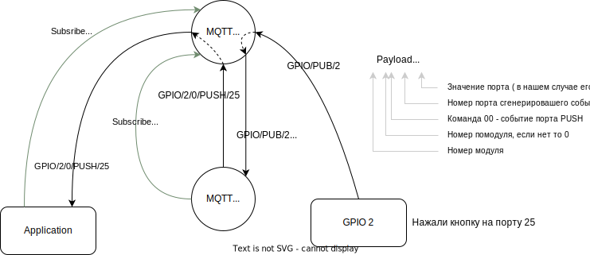

# GPIO - Ethernet

https://www.cdebyte.com/products/NT1-B

## Настройка модуля

Настройка модуля

  
Первоначально модуль сидит на статическом адресе 192.168.3.3
настраиваем сеть компа и заходим

Настоятельно рекомендую настроить именно автоматическое получение адреса по DHCP.

Устанавливаем там где 0, нужный нам порядковый номер модуля и нажимаем submit,
пароль для сохранения 123456 после чего перезагружаем по питанию.

В сети его потом можно будет найти по доменному имени MAC адресу:

## Команды

Все команды четырехбайтовые: номер_модуля/команда/порт/значение

Для преобразования в удобочитаемые команды применяется сервис [mqtt_gpio](mqtt_gpio_service/readme.md)

MQTT -> GPIO

| команда                      | описание                   |
|------------------------------|----------------------------|
| 00 **00** (00..32) 00        | выключить порт (00..32)    |
| 00 **00** (00..32) (1..255)  | включить порт (00..32)     |
| 00 **00** (00..32) (0..255)  | установить PWM в процентах |
| 00 **03** byte0 byte1        | команда DALI               |

### GPIO -> MQTT

| команда     | описание                                    |
|-------------|---------------------------------------------|
| 02 00 25 00 | нажали кнопку на порту 25 модуля 2 (00..31) |

Подробнее

## Структура программы

[**Работаем с CLion**](clion/clion.md)

## Модульная система

Модули могут работать как одиночно, в этом случае они подключаются по Ethernet, так и связываться по шине CAN, если в данном месте модулей нужно более одного.

## Распайка компонентов портов

[см.](gpio_pic/readme.md)
