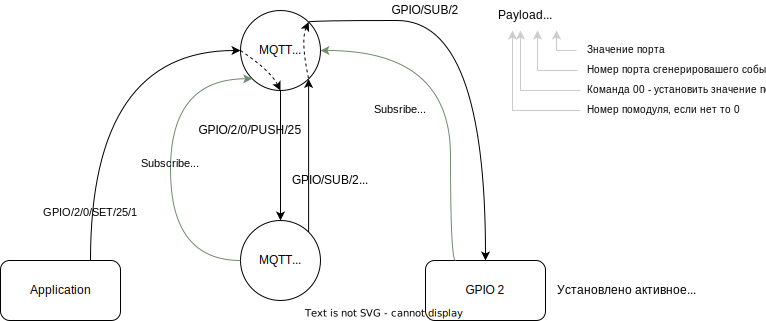

# MQTT-GPIO


https://www.cdebyte.com/products/NT1-B


## Первоначальная настройка модуля NT1-B

<details><summary>Настройка модуля</summary>

Первоначально модуль сидит на статическом адресе 192.168.3.3
настраиваем сеть компа и заходим


Настоятельно рекомендую настроить именно автоматическое получение адреса по DHCP.

Устанавливаем там где 0, нужный нам порядковый номер модуля и нажимаем submit,
пароль для сохранения 123456 после чего перезагружаем по питанию.

В сети его потом можно будет найти по доменному имени MAC адресу:


</details>

## Команды

Все команды 4-х байтовые: номер_подмодуля/команда/порт/значение

Для преобразования в удобочитаемые команды применяется сервис mqtt_gpio

### MQTT -> GPIO

| команда (UART -> STM32)     | описание                                 | Mqtt                       |
|-----------------------------|------------------------------------------|----------------------------|
| 00 **00** (00..31) 00       | выключить порт (00..31)                  | `GPIO/1/0/SET/25/0`        |
| 00 **00** (00..31) (1..255) | включить порт (00..31)                   | `GPIO/1/0/SET/25/1`        |
| 00 **00** (00..31) (0..255) | установить PWM в процентах               | `GPIO/1/0/SET/25/124`      |
| 00 **03** byte0 byte1       | команда DALI                             |                            |
|                             | установить значение светильника 25 в 124 | `GPIO/1/DALI/SET/25/124`   |
|                             | установить значение группы 12 в 0        | `GPIO/1/DALI/SET_GRP/12/0` |
|                             | команда RAW DALI                         | `GPIO/1/DALI/RAW`          |

Внимание! Если мы обращаемся к нулевому (единственному) подмодулю, то можно подмодуль не указывать:  
вместо `GPIO/1/0/SET/25/1` пишем `GPIO/1/SET/25/1`

> 00 - подмодуль  
> 00 - команда SET  
> (00..31) - номер порта  
> 00 - значение

<details><summary>Подробнее</summary>



</details>

### GPIO -> MQTT

#### PUSH

| команда (STM32 -> UART) | событие      | описание                           |
|-------------------------|--------------|------------------------------------|
| 00 **_00_** 25 00       | PUSH         | нажали кнопку на порту 25 модуля 2 |

> 00 - подмодуль  
> 00 - команда PUSH  
> 25 - номер порта  
> 00 - значение (в данном случае не используется)

`GPIO/2/0/PUSH/25`

<details><summary>Подробнее</summary>


</details>

#### DALI RAW

> **Описание [DALI](dali/readme.md)**

Ответ, поступивший по шине DALI

| команда (STM32 -> UART) | событие      | описание           |
|-------------------------|--------------|--------------------|
| 00 **_03_** byte1       | DALI/RAW_RET | ответ от шины DALI |

`GPIO/2/DALI/RAW_RET/`

## Хранение информации о портах и их последующая компиляция

[прошивка программы](write_fw/readme.md)

<details><summary>Подробнее</summary>

```yaml
0: [ "button", "output", "led_button_led", "gpio_exti15" ]                         # PB15
1: [ "button", "output", "led_button", "gpio_exti14" ]                             # PB14
2: [ "button", "output", "led_button_led", "gpio_exti12" ]                         # PB12
3: [ "button", "output", "led_button", "gpio_exti10" ]                             # PB10
4: [ "button", "output", "led_button_led", "tim3_ch4", "gpio_exti1" ]              # PB1
5: [ "button", "output", "led_button", "tim3_ch3", "gpio_exti0" ]                  # PB0
6: [ "button", "output", "led_button_led", "gpio_exti13" ]                         # PB13
7: [ "button", "output", "led_button", "gpio_exti11" ]                             # PB11
8: [ "button", "output", "led_button_led", "gpio_exti2" ]                          # PB2
9: [ "button", "output", "led_button" , "tim3_ch2", "gpio_exti7" ]                 # PA7
10: [ "button", "output", "led_button_led", "tim3_ch1", "gpio_exti6" ]             # PA6
11: [ "button", "output", "led_button", "gpio_exti8" ]                             # PB8
12: [ "button", "output", "led_button_led", "gpio_exti7" ]                         # PB7
13: [ "button", "output", "led_button", "gpio_exti4" ]                             # PB4
14: [ "button", "output", "led_button_led", "gpio_exti5" ]                         # PA5
15: [ "button", "output", "led_button", "gpio_exti9" ]                             # PB9
16: [ "button", "output", "led_button_led", "gpio_exti6" ]                         # PB6
17: [ "button", "output", "led_button", "gpio_exti3" ]                             # PB3
18: [ "button", "output", "led_button_led", "gpio_exti15" ]                        # PA15
19: [ "button", "output", "led_button", "gpio_exti14" ]                            # PC14
20: [ "button", "output", "led_button_led", "gpio_exti3" ]                         # PA3
21: [ "button", "output", "led_button", "gpio_exti2" ]                             # PA2
```

```json
{
  "0": {
    "type": "button",
    "active_level": 0,
    "long_press": 0
  },
  "1": {
    "type": "output",
    "active_level": 0
  },
  "2": {
    "type": "led_button",
    "active_level": 0
  },
  "3": {
    "type": "led_button_led"
  },
  "4": {
    "type": "counter",
    "active_level": 0,
    "tick": 1000
  }
}
```

</details>


Просмотр портов в реестре. Программа `com0com` нужна для того чтобы сделать петлю.


## Модульная система

Модули могут работать как одиночно, в этом случае они подключаются по Ethernet, так и связываться по шине CAN, если в
данном месте модулей нужно более одного.


## Распайка компонентов портов

[см.](gpio_pic/readme.md)

## Реализация на stm32qubeMX

[stm32qubeMX](stm32qube/readme.md)

### Uart1

