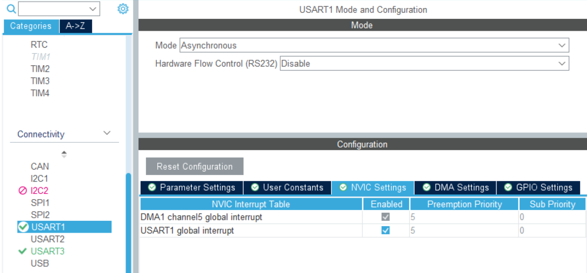
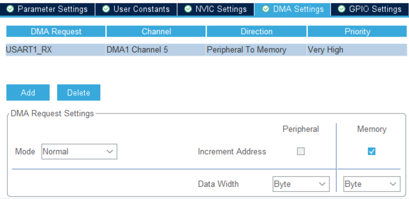

# Реализация на stm32qubeMX

## Uart1





```c
uint8_t UART1_rxBuffer[4] = {0};

void HAL_UART_RxCpltCallback(UART_HandleTypeDef *huart)
{
    HAL_UART_Receive_DMA(&huart1, UART1_rxBuffer, 4);
}
```