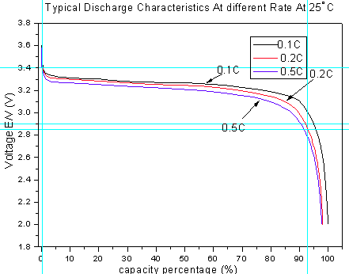

# Электропитание

* [dc/dc конверторы](dc_dc/readme.md)

Проще и дешевле всего применить хорошо зарекомендовавшие себя модули заряда и контроля батарей
от солнечных систем электропитания.

Например такой [модуль](https://powmr.com/solar-charge-controller/current/40amps-mppt/powmr-40a-mppt-solar-charge-controller-12v-24v-36v-48v-auto-solar-regulator-with-lcd-display-mppt-40a/)
более чем достаточен. Можно даже [попроще](https://powmr.com/solar-charge-controller/series-en/solar-laderegler-pwm-30a-40a-50a-60a-80a-automat-solar-controller-12v-24v-36v-48v-pv100v-lithiumbatterien-ternare-lithiumbatterien-lithiumeisenphosphat-usw./)

Лучше всего применить LiFePO4 аккумуляторы.

|                                 |                                                | 14s  | 15s  | на ячейку |
|---------------------------------|------------------------------------------------|------|------|-----------|
| Recovery Charging Voltage       | Напряжение восстановления заряда               | 47,6 | 51   | 3,4       |
| Constant Charging Voltage       | Постоянное напряжение зарядки (буферный режим) | 50,4 | 54   | 3,6       |
| Low Voltage Disconnection       | Отключение при низком напряжении               | 39,2 | 42   | 2,8       |
| Low Voltage Reconnection        | Повторное подключение                          | 44,8 | 48   | 3,2       |
| Load Over-Voltage Disconnection | Отключение от перенапряжения нагрузки          | 51,8 | 55,5 | 3,7       |
| Load Over-Voltage Re-connection | Повторное подключение перенапряжения нагрузки  | 50,4 | 54   | 3,6       |

Батарея из 14 элементов 6 Ач (ценой 3500 р), продержится при нагрузке в 100 Вт не менее 2,5 часов,  
при диапазоне выходного напряжения 3,4..2,8 В или 47,6..39,2  
возможно следует поднять нижнюю границу до 2,85..2,9 В или 40..40,6 В

Циклы зарядки на примере PowMr контроллера

Имеется 3 встроенных режима зарядки (массовый, форсированный, плавающий). Благодаря трем этапам быстрого, эффективного и безопасного режима зарядки аккумулятора система может эффективно продлить срок службы аккумулятора.
Встроенные режимы зарядки в сочетании с адаптивной логикой зарядки хорошо подходят для большинства распространенных типов аккумуляторов: таких как свинцово-кислотные, гелевые и LiFePO4.
Любые сделанные настройки сохраняются и не теряются при отключении контроллера от аккумулятора или фотоэлектрического модуля.
Алгоритм многоступенчатой зарядки включает в себя отдельные этапы зарядки, описанные ниже:

Массовый заряд:

Аккумулятор заряжается максимальным зарядным током до тех пор, пока напряжение не увеличится до настроенного напряжения ускоренной зарядки. Продолжительность объемной стадии зависит от уровня разряда аккумулятора.
емкость аккумулятора и ток заряда. Когда напряжение аккумулятора достигает заданного значения напряжения ускоренной зарядки, начинается ускоренная зарядка.

Повышение заряда:

Аккумулятор заряжается при настроенном напряжении ускоренной зарядки, при этом зарядный ток медленно уменьшается по мере приближения к полной зарядке аккумулятора.
Продолжительность этапа ускорения по умолчанию является адаптивной и интеллектуально варьируется в зависимости от уровня разряда аккумулятора – он определяется длительностью этапа объемного заряда.
При повторном подключении фотоэлектрического модуля начнется новый цикл зарядки. Если аккумулятор полностью заряжен, этап зарядки сразу перейдет в этап B, то есть ускоренную зарядку.
этап напряжения, и напряжение батареи на этом этапе не будет выше установленного напряжения этапа B. В настоящее время продолжительность этапа B составляет 30 минут.

Плавающий заряд:

В конце этапа ускоренной зарядки контроллер снизит напряжение батареи за счет уменьшения зарядного тока и будет постоянно поддерживать для батареи установленное значение плавающего зарядного напряжения, равное
поддерживать полный заряд аккумулятора.
На этапе плавающей зарядки нагрузки могут получать почти всю мощность от солнечной панели. Если нагрузка превышает мощность, контроллер больше не сможет поддерживать напряжение батареи на этапе плавающей зарядки. Если
напряжение аккумулятора остается ниже напряжения перезарядки, система выйдет из этапа плавающей зарядки и вернется к этапу массовой зарядки.